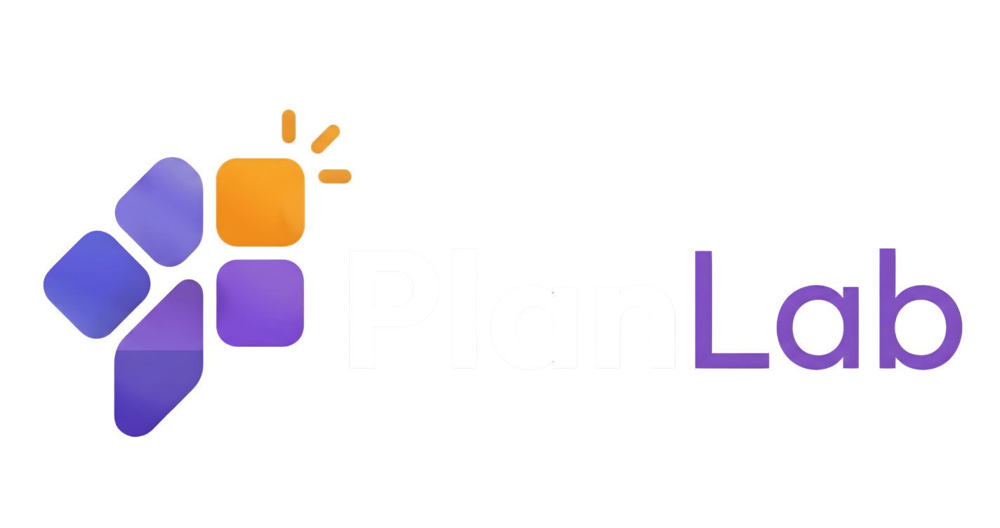

<p align="center">
  <picture>
    <source media="(prefers-color-scheme: dark)" srcset="./public/branding/planlab-logo-dark.png" />
    <source media="(prefers-color-scheme: light)" srcset="./public/branding/planlab-logo-light.png" />
    
  </picture>
</p>

<h1 align="center">PlanLab</h1>

<p align="center">
  <strong>Tu laboratorio pedagógico inteligente</strong>
</p>

<p align="center">
  Plataforma EdTech para planificar clases, gestionar grupos, programar actividades, registrar resultados, generar reportes y fortalecer decisiones pedagógicas con Inteligencia Artificial.
</p>

<p align="center">
  
  
  
  
</p>

---

## ✨ ¿Qué es PlanLab?

**PlanLab** es una plataforma pedagógica moderna diseñada para centralizar el flujo de trabajo docente en un solo entorno.  
Permite organizar el proceso académico desde la planeación hasta el seguimiento de resultados, integrando herramientas de gestión, exportación documental y apoyo con Inteligencia Artificial.

Su objetivo es transformar un flujo disperso y manual en una experiencia más clara, estructurada y útil para el docente.

---

## 🎯 Propósito del proyecto

En muchos contextos educativos, la planeación, el seguimiento y los reportes se realizan en múltiples formatos, plataformas o documentos aislados.  
**PlanLab** busca resolver ese problema integrando en una sola solución:

- Planeación de clases
- Gestión de grupos y estudiantes
- Programación de actividades
- Registro de asistencia, notas y observaciones
- Análisis de resultados
- Generación de reportes
- Asistencia pedagógica con IA

---

### 🔄 Flujo Core del Producto
`👥 Grupos` ➔ `🧑‍🎓 Estudiantes` ➔ `📝 Planes` ➔ `📅 Actividades` ➔ `📊 Resultados` ➔ `📑 Reportes`

---

## 🚀 Características principales

PlanLab reúne las herramientas esenciales para acompañar el trabajo docente desde la planeación hasta el análisis de resultados.

### 📚 Gestión académica

- Autenticación real con protección de rutas privadas.
- Gestión de perfil docente.
- CRUD de grupos.
- CRUD de estudiantes.
- CRUD de planes.
- CRUD de actividades.
- Registro de resultados por estudiante.
- Reportes académicos generados desde datos reales.

### 🤖 Inteligencia Artificial aplicada

- Generación estructurada de planes de clase.
- Mejora de planes existentes con IA.
- Estrategias de refuerzo basadas en resultados.
- Validación estricta con esquemas tipados.
- Respuestas controladas en formato estructurado.

### 📄 Exportación documental

- Exportación de planes en PDF.
- Exportación de planes en Word editable `.docx`.
- Exportación de reportes en PDF.
- Organización y descarga de documentos académicos.

### 🎨 Experiencia de usuario

- Interfaz moderna.
- Modo oscuro y modo claro.
- Diseño responsive.
- Buscador global.
- Notificaciones del sistema.
- Estados vacíos, skeletons y feedback visual.
- Navegación modular clara y consistente.

---

## 🧩 Módulos del sistema

### 1. Grupos y Estudiantes

Permite organizar los cursos y administrar la base de estudiantes por grupo.  
Incluye edición individual e importación masiva para agilizar la carga inicial de información.

### 2. Planes

Espacio para crear, editar, duplicar y enriquecer planes de clase.  
Integra asistencia con IA para generar propuestas pedagógicas mejoradas y estructuradas.

### 3. Actividades

Permite programar actividades específicas a partir de un plan, asociarlas a un grupo, definir fecha, estado y realizar seguimiento académico.

### 4. Resultados

Consolida asistencia, notas y observaciones por estudiante.  
También genera indicadores por grupo y alertas pedagógicas para facilitar la toma de decisiones.

### 5. Reportes

Construye reportes académicos a partir de la información real del sistema y facilita su exportación formal en documentos listos para consulta o entrega.

---

## 🛠️ Tecnologías utilizadas

<p align="center">
  
  
  
  
  
  
  
  
  
  
  
</p>

### Resumen técnico

| Capa | Tecnología |
|------|------------|
| Frontend | Next.js, React, TypeScript |
| Estilos | Tailwind CSS |
| Backend / BaaS | Supabase |
| Base de datos | PostgreSQL vía Supabase |
| Autenticación | Supabase Auth |
| Storage | Supabase Storage |
| Validación | Zod |
| Formularios | React Hook Form |
| IA | Gemini |
| Exportación PDF | `@react-pdf/renderer` |
| Exportación Word | `docx` |
| Despliegue | Vercel |

---
## 🏗️ Arquitectura del Proyecto

El código está organizado siguiendo principios de diseño modular (Feature-Sliced Design), separando responsabilidades para escalar sin fricción.

```text
src/
 ├── app/           # Rutas (App Router), layouts, route handlers y middleware
 ├── components/    # Componentes globales de UI, layout y utilitarios
 ├── features/      # Módulos por dominio: auth, plans, activities, results...
 ├── lib/           # Utilidades core: supabase, gemini, export, validaciones
 └── styles/        # Estilos globales

## 📌 Filosofía de diseño

PlanLab está pensado como una plataforma académica con lógica de producto real, no solo como una demo visual.  
Cada módulo fue estructurado para que el docente pueda trabajar de forma clara, rápida y organizada, manteniendo una experiencia moderna y coherente.

### Principios del sistema

- **Claridad pedagógica:** la información se presenta de forma comprensible y orientada al trabajo docente.
- **Flujo estructurado:** el sistema sigue una secuencia natural: grupos, estudiantes, planes, actividades, resultados y reportes.
- **Interfaz limpia:** la experiencia visual prioriza legibilidad, orden y facilidad de uso.
- **Datos reales persistidos:** la información se almacena y consulta desde una base de datos real.
- **IA integrada con control:** la Inteligencia Artificial apoya el proceso, pero no reemplaza la decisión docente.
- **Exportación institucional:** los documentos generados están pensados para uso académico y presentación formal.
- **Escalabilidad modular:** cada módulo puede crecer o mejorarse sin afectar todo el sistema.

---

## 🔐 Seguridad y control

El proyecto implementa una estructura pensada para proteger la información del usuario, controlar el acceso a los datos y mantener la consistencia del sistema.

### Consideraciones clave

- Protección de rutas privadas.
- Uso de autenticación real.
- Validación de datos en frontend y backend.
- Aislamiento de información por usuario autenticado.
- Row Level Security `RLS` en Supabase.
- Uso de Server Actions y Route Handlers para tareas sensibles.
- Claves privadas protegidas mediante variables de entorno.
- Separación entre lógica de cliente y lógica de servidor.

---

## 🤖 Enfoque de la Inteligencia Artificial

La IA en PlanLab no se plantea como un chatbot libre, sino como una herramienta integrada al flujo pedagógico.  
Esto permite que las respuestas generadas sean estructuradas, validadas y útiles dentro del contexto académico.

### Esto permite que las respuestas sean

- útiles,
- estructuradas,
- validadas,
- coherentes con el contexto educativo,
- seguras para integrarse al sistema.

### Usos actuales de la IA

- Generación de planes de clase.
- Mejora de planes ya existentes.
- Propuestas pedagógicas estructuradas.
- Estrategias de refuerzo por resultados.
- Apoyo en la organización de actividades y tiempos.

---

## 📄 Exportaciones del sistema

PlanLab permite generar documentos académicos a partir de la información real registrada en la plataforma.  
Estas exportaciones están pensadas para facilitar el uso institucional, la revisión docente y la presentación formal de la información.

### Exportaciones disponibles

- Plan de clase en PDF.
- Plan de clase en Word editable.
- Reportes en PDF.
- Documentos organizados por módulo y contexto.

### Objetivo de estas exportaciones

- Facilitar el uso institucional.
- Permitir edición posterior cuando sea necesario.
- Ofrecer documentos claros, formales y listos para impresión.
- Reducir la carga manual en la elaboración de reportes académicos.

---

## ⚙️ Variables de entorno

Crea un archivo `.env.local` en la raíz del proyecto con esta estructura:

```env
NEXT_PUBLIC_SUPABASE_URL=tu_url_aqui
NEXT_PUBLIC_SUPABASE_PUBLISHABLE_KEY=tu_anon_key_aqui
GEMINI_API_KEY=tu_api_key_de_google_aqui
GEMINI_MODEL=gemini-3-flash-preview
SUPABASE_DOCUMENTS_BUCKET=documents

---

## 🧱 Requisitos de Supabase

Asegúrate de tener lo siguiente correctamente configurado:

- Proyecto activo en Supabase.
- Autenticación por correo habilitada.
- Tablas del sistema creadas.
- Row Level Security activa.
- Policies adecuadas por usuario autenticado.
- Bucket de documentos creado.
- Tabla de notificaciones disponible si se usa el centro de notificaciones.
- Variables de conexión correctamente configuradas en el entorno local o en producción.

---

## ▶️ Instalación del proyecto

### 1. Clonar el repositorio

```bash
git clone [https://github.com/Fernandezb12/PlanLab.git](https://github.com/Fernandezb12/PlanLab.git)
cd planlab

### 2. Instalar dependencias

```bash
npm install

3. Ejecutar en desarrollo
npm run dev

La aplicación estará disponible en:

http://localhost:3000

### 📜 Scripts útiles
```bash
npm run typecheck   # Revisa tipado estricto
npm run lint        # Revisa reglas de código
npm run build       # Simula compilación de producción

Recomendación de verificación antes de desplegar

## Validación recomendada antes de publicar

```bash
npm run typecheck
npm run lint
npm run build
```

## Autoría

Desarrollado por Daniel Fernandez para la evolución de PlanLab como producto edtech profesional.